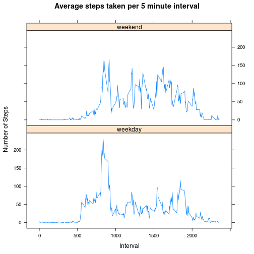

<!-- rmarkdown v1 -->

# Introduction

This report interprets the raw data collected from a personal activity 
monitoring device. This device collects data at 5 minute intervals through 
out the day. The data consists of two months of data from an anonymous 
individual collected during the months of October and November, 2012 and 
include the number of steps taken in 5 minute intervals each day.

Raw dataset used for this report is located 
[here](https://d396qusza40orc.cloudfront.net/repdata%2Fdata%2Factivity.zip)

## Loading and preprocessing the data

The raw data is downloaded and preprocessed for analysis.  


```r
library(xtable)
if (!file.exists("./activity.csv")){
  download.file("https://d396qusza40orc.cloudfront.net/repdata%2Fdata%2Factivity.zip",
                "./repdata_activity.zip", method="wget")
  unzip("./repdata_activity.zip")
}
activity <- read.csv("./activity.csv")
```

## What is mean total number of steps taken per day?

First the data is processed to remove the missing values then the total number of steps taken per day, mean and median are computed.


```r
complete_activity <- activity[complete.cases(activity),]
sum_per_day <- tapply(complete_activity$steps, complete_activity$date,sum)
complete_sum <- sum_per_day[complete.cases(sum_per_day)]
mean_day <- mean(complete_sum)
median_day <- median(complete_sum)
```

The frequency of the total number of steps taken per day is shown in the 
following histogram.


```r
hist(complete_sum, main="Frequency of total steps taken per day", 
     xlab = "Number of steps taken per day")
```

 

Mean and Median of the total number of steps taken per day are 10766.1886792453
and 10765 respectively

## What is the average daily activity pattern?

The daily average is computed and then the step with the maximum average is obtained.


```r
avg_daily <- tapply(complete_activity$steps, complete_activity$interval,mean)
maximum_avg_index <- labels(which.max(avg_daily))
```

Time series plot for daily average for each interval is shown below


```r
plot(x = labels(avg_daily)[[1]], y = as.numeric(avg_daily),
     xlab="Time interval (minute)", ylab="Steps",
     main="Average number of steps taken for all days", type="l")
```

 

835 interval contains the maximum average number of steps of 206.1698

## Imputing missing values

Imputing the missing values with the mean of the 5 minute interval and compute the mean and median of the total number of steps taken each day


```r
sum_na <- sum(is.na(activity))
filled_activity <- activity
for (i in seq_len(nrow(filled_activity))) {
        if (is.na(filled_activity[i,"steps"])) {
                filled_activity[i,"steps"] = 
                        as.numeric(avg_daily[as.character(filled_activity[i,"interval"])])
        }
}
filled_sum_per_day <- tapply(filled_activity$steps, filled_activity$date,sum)
filled_mean_day <- mean(filled_sum_per_day)
filled_median_day <- median(filled_sum_per_day)
merged_sum <- cbind(sum_per_day,filled_sum_per_day)
colnames(merged_sum) <- c("Complete cases sum per day", "Imputted sum per day")
```

The total number of missing values are 2304. Frequency of the total steps taken per day is shown in the following histogram


```r
hist(filled_sum_per_day, main="Frequency of total steps taken per day", 
     xlab = "Number of steps taken per day")
```

 

Mean and Median of the total number of steps taken per day are 10766.1886792453
and 10766.1886792453 respectively. Imputting the missing values has no 
difference on the mean computed previously (in the first question) because the missing data was filled with means but the 
median had a small difference. 

The total daily step between the complete case and imputted case is tabulated 
below. The difference is seen only on the days where no data was collected. 


```r
library(xtable)
xtab <- xtable(merged_sum)
print(xtab, type="html")
```

<!-- html table generated in R 3.1.1 by xtable 1.7-4 package -->
<!-- Sun Oct 19 09:52:23 2014 -->
<table border=1>
<tr> <th>  </th> <th> Complete cases sum per day </th> <th> Imputted sum per day </th>  </tr>
  <tr> <td align="right"> 2012-10-01 </td> <td align="right">  </td> <td align="right"> 10766.19 </td> </tr>
  <tr> <td align="right"> 2012-10-02 </td> <td align="right"> 126.00 </td> <td align="right"> 126.00 </td> </tr>
  <tr> <td align="right"> 2012-10-03 </td> <td align="right"> 11352.00 </td> <td align="right"> 11352.00 </td> </tr>
  <tr> <td align="right"> 2012-10-04 </td> <td align="right"> 12116.00 </td> <td align="right"> 12116.00 </td> </tr>
  <tr> <td align="right"> 2012-10-05 </td> <td align="right"> 13294.00 </td> <td align="right"> 13294.00 </td> </tr>
  <tr> <td align="right"> 2012-10-06 </td> <td align="right"> 15420.00 </td> <td align="right"> 15420.00 </td> </tr>
  <tr> <td align="right"> 2012-10-07 </td> <td align="right"> 11015.00 </td> <td align="right"> 11015.00 </td> </tr>
  <tr> <td align="right"> 2012-10-08 </td> <td align="right">  </td> <td align="right"> 10766.19 </td> </tr>
  <tr> <td align="right"> 2012-10-09 </td> <td align="right"> 12811.00 </td> <td align="right"> 12811.00 </td> </tr>
  <tr> <td align="right"> 2012-10-10 </td> <td align="right"> 9900.00 </td> <td align="right"> 9900.00 </td> </tr>
  <tr> <td align="right"> 2012-10-11 </td> <td align="right"> 10304.00 </td> <td align="right"> 10304.00 </td> </tr>
  <tr> <td align="right"> 2012-10-12 </td> <td align="right"> 17382.00 </td> <td align="right"> 17382.00 </td> </tr>
  <tr> <td align="right"> 2012-10-13 </td> <td align="right"> 12426.00 </td> <td align="right"> 12426.00 </td> </tr>
  <tr> <td align="right"> 2012-10-14 </td> <td align="right"> 15098.00 </td> <td align="right"> 15098.00 </td> </tr>
  <tr> <td align="right"> 2012-10-15 </td> <td align="right"> 10139.00 </td> <td align="right"> 10139.00 </td> </tr>
  <tr> <td align="right"> 2012-10-16 </td> <td align="right"> 15084.00 </td> <td align="right"> 15084.00 </td> </tr>
  <tr> <td align="right"> 2012-10-17 </td> <td align="right"> 13452.00 </td> <td align="right"> 13452.00 </td> </tr>
  <tr> <td align="right"> 2012-10-18 </td> <td align="right"> 10056.00 </td> <td align="right"> 10056.00 </td> </tr>
  <tr> <td align="right"> 2012-10-19 </td> <td align="right"> 11829.00 </td> <td align="right"> 11829.00 </td> </tr>
  <tr> <td align="right"> 2012-10-20 </td> <td align="right"> 10395.00 </td> <td align="right"> 10395.00 </td> </tr>
  <tr> <td align="right"> 2012-10-21 </td> <td align="right"> 8821.00 </td> <td align="right"> 8821.00 </td> </tr>
  <tr> <td align="right"> 2012-10-22 </td> <td align="right"> 13460.00 </td> <td align="right"> 13460.00 </td> </tr>
  <tr> <td align="right"> 2012-10-23 </td> <td align="right"> 8918.00 </td> <td align="right"> 8918.00 </td> </tr>
  <tr> <td align="right"> 2012-10-24 </td> <td align="right"> 8355.00 </td> <td align="right"> 8355.00 </td> </tr>
  <tr> <td align="right"> 2012-10-25 </td> <td align="right"> 2492.00 </td> <td align="right"> 2492.00 </td> </tr>
  <tr> <td align="right"> 2012-10-26 </td> <td align="right"> 6778.00 </td> <td align="right"> 6778.00 </td> </tr>
  <tr> <td align="right"> 2012-10-27 </td> <td align="right"> 10119.00 </td> <td align="right"> 10119.00 </td> </tr>
  <tr> <td align="right"> 2012-10-28 </td> <td align="right"> 11458.00 </td> <td align="right"> 11458.00 </td> </tr>
  <tr> <td align="right"> 2012-10-29 </td> <td align="right"> 5018.00 </td> <td align="right"> 5018.00 </td> </tr>
  <tr> <td align="right"> 2012-10-30 </td> <td align="right"> 9819.00 </td> <td align="right"> 9819.00 </td> </tr>
  <tr> <td align="right"> 2012-10-31 </td> <td align="right"> 15414.00 </td> <td align="right"> 15414.00 </td> </tr>
  <tr> <td align="right"> 2012-11-01 </td> <td align="right">  </td> <td align="right"> 10766.19 </td> </tr>
  <tr> <td align="right"> 2012-11-02 </td> <td align="right"> 10600.00 </td> <td align="right"> 10600.00 </td> </tr>
  <tr> <td align="right"> 2012-11-03 </td> <td align="right"> 10571.00 </td> <td align="right"> 10571.00 </td> </tr>
  <tr> <td align="right"> 2012-11-04 </td> <td align="right">  </td> <td align="right"> 10766.19 </td> </tr>
  <tr> <td align="right"> 2012-11-05 </td> <td align="right"> 10439.00 </td> <td align="right"> 10439.00 </td> </tr>
  <tr> <td align="right"> 2012-11-06 </td> <td align="right"> 8334.00 </td> <td align="right"> 8334.00 </td> </tr>
  <tr> <td align="right"> 2012-11-07 </td> <td align="right"> 12883.00 </td> <td align="right"> 12883.00 </td> </tr>
  <tr> <td align="right"> 2012-11-08 </td> <td align="right"> 3219.00 </td> <td align="right"> 3219.00 </td> </tr>
  <tr> <td align="right"> 2012-11-09 </td> <td align="right">  </td> <td align="right"> 10766.19 </td> </tr>
  <tr> <td align="right"> 2012-11-10 </td> <td align="right">  </td> <td align="right"> 10766.19 </td> </tr>
  <tr> <td align="right"> 2012-11-11 </td> <td align="right"> 12608.00 </td> <td align="right"> 12608.00 </td> </tr>
  <tr> <td align="right"> 2012-11-12 </td> <td align="right"> 10765.00 </td> <td align="right"> 10765.00 </td> </tr>
  <tr> <td align="right"> 2012-11-13 </td> <td align="right"> 7336.00 </td> <td align="right"> 7336.00 </td> </tr>
  <tr> <td align="right"> 2012-11-14 </td> <td align="right">  </td> <td align="right"> 10766.19 </td> </tr>
  <tr> <td align="right"> 2012-11-15 </td> <td align="right"> 41.00 </td> <td align="right"> 41.00 </td> </tr>
  <tr> <td align="right"> 2012-11-16 </td> <td align="right"> 5441.00 </td> <td align="right"> 5441.00 </td> </tr>
  <tr> <td align="right"> 2012-11-17 </td> <td align="right"> 14339.00 </td> <td align="right"> 14339.00 </td> </tr>
  <tr> <td align="right"> 2012-11-18 </td> <td align="right"> 15110.00 </td> <td align="right"> 15110.00 </td> </tr>
  <tr> <td align="right"> 2012-11-19 </td> <td align="right"> 8841.00 </td> <td align="right"> 8841.00 </td> </tr>
  <tr> <td align="right"> 2012-11-20 </td> <td align="right"> 4472.00 </td> <td align="right"> 4472.00 </td> </tr>
  <tr> <td align="right"> 2012-11-21 </td> <td align="right"> 12787.00 </td> <td align="right"> 12787.00 </td> </tr>
  <tr> <td align="right"> 2012-11-22 </td> <td align="right"> 20427.00 </td> <td align="right"> 20427.00 </td> </tr>
  <tr> <td align="right"> 2012-11-23 </td> <td align="right"> 21194.00 </td> <td align="right"> 21194.00 </td> </tr>
  <tr> <td align="right"> 2012-11-24 </td> <td align="right"> 14478.00 </td> <td align="right"> 14478.00 </td> </tr>
  <tr> <td align="right"> 2012-11-25 </td> <td align="right"> 11834.00 </td> <td align="right"> 11834.00 </td> </tr>
  <tr> <td align="right"> 2012-11-26 </td> <td align="right"> 11162.00 </td> <td align="right"> 11162.00 </td> </tr>
  <tr> <td align="right"> 2012-11-27 </td> <td align="right"> 13646.00 </td> <td align="right"> 13646.00 </td> </tr>
  <tr> <td align="right"> 2012-11-28 </td> <td align="right"> 10183.00 </td> <td align="right"> 10183.00 </td> </tr>
  <tr> <td align="right"> 2012-11-29 </td> <td align="right"> 7047.00 </td> <td align="right"> 7047.00 </td> </tr>
  <tr> <td align="right"> 2012-11-30 </td> <td align="right">  </td> <td align="right"> 10766.19 </td> </tr>
   </table>

## Are there differences in activity patterns between weekdays and weekends?
Firstly, a new column is added to the dataset to store the date type (ie) whether the date falls on a weekday or weekend. Then the average steps for each date type and interval is computed.


```r
library(reshape2)
filled_activity[ ,"date"] <- as.Date(filled_activity[, "date"], "%Y-%m-%d")
filled_activity[,"DayType"] <- sapply(weekdays(filled_activity[,"date"]),
                                      function(x) 
                                              if (x == "Sunday" || x== "Saturday") 
                                                   "weekend" 
                                              else "weekday"
                                      )
filled_activity_avg <- dcast(filled_activity, DayType~interval, value.var="steps", mean)
melt_filled_activity_avg <- melt(filled_activity_avg, id="DayType", variable.name="Interval")
melt_filled_activity_avg[ ,"Interval"] <- as.numeric(as.character(melt_filled_activity_avg[,"Interval"]))
```

Below is the panel plot that shows the average steps taken during the weekday and weekend. In the plot we can see, the average steps taken is overall higher in the weekend.


```r
library(lattice)
xyplot(value~Interval | DayType, data = melt_filled_activity_avg, 
       layout = c(1,2), ylab="Number of Steps", type="l", main="Average steps taken per 5 minute interval")
```

 
